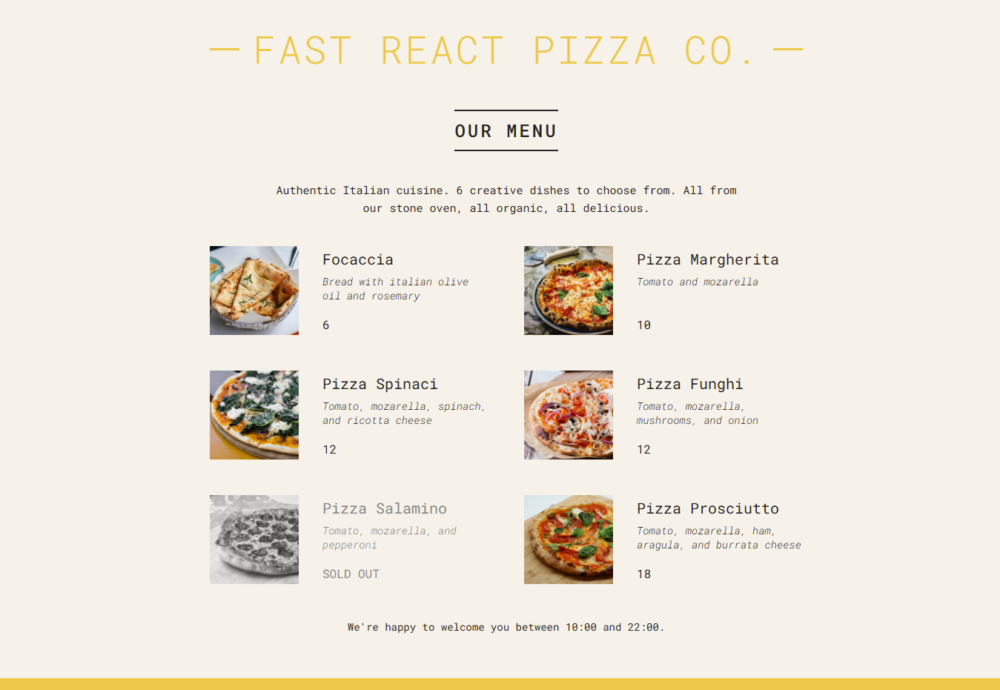

# Fast React Pizza Co.



## Table of Contents

- [About](#about)
- [Features](#features)
- [Technologies Used](#technologies-used)
- [Installation](#installation)
- [Usage](#usage)
- [Contributing](#contributing)
- [License](#license)

## About

Fast React Pizza Co. is a modern web application showcasing an elegant and responsive menu for a fictional pizza restaurant. Built using React, this project demonstrates key React concepts such as component architecture, props, state management, and conditional rendering.

The project aims to offer a clean, minimalist interface for browsing a menu, viewing item details, and indicating availability (e.g., sold-out items).

---

## Features

- **Dynamic Menu Rendering**: Items are displayed dynamically using data-driven components.
- **Sold-Out Indicators**: Clear visual cues for unavailable menu items.
- **Responsive Design**: Ensures usability across devices.
- **Opening Hours Notification**: Dynamically displays the restaurant’s open or closed status based on current time.
- **Reusable Components**: Modular React components for scalability and maintainability.

## Technologies Used

- **React**: For building user interfaces.
- **JavaScript (ES6+)**: Core language features including arrow functions, destructuring, and template literals.
- **CSS**: Custom styles with modern CSS techniques such as Flexbox and Grid.
- **Google Fonts**: "Roboto Mono" font for enhanced typography.

## Installation

To run the project locally:

1. Clone the repository:

   ```bash
   git clone https://github.com/your-username/fast-react-pizza-co.git
   cd fast-react-pizza-co
   ```

2. Install dependencies:

   ```bash
   npm install
   ```

3. Start the development server:

   ```bash
   npm start
   ```

4. Open your browser and navigate to `http://localhost:3000` to view the app.

## Usage

- Launch the app and explore the dynamic menu of pizzas.
- Sold-out items are grayed out and marked with a "SOLD OUT" label.
- A footer displays whether the restaurant is currently open or closed, based on the current time.
- Button to "Order" is provided for available menu items.

---

## Project Structure

```
src/
├── index.js       # Main React entry file
├── index.css      # Global styles
├── components/    # (Future-ready for additional components)
└── assets/        # (Placeholder for images or other static resources)
```

---

## Contributing

Contributions are welcome! If you have suggestions or improvements, please fork the repository and create a pull request.

1. Fork the repository.
2. Create a new branch:
   ```bash
   git checkout -b feature/YourFeature
   ```
3. Commit your changes:
   ```bash
   git commit -m "Add YourFeature"
   ```
4. Push to the branch:
   ```bash
   git push origin feature/YourFeature
   ```
5. Open a pull request.

---

## License

This project is licensed under the MIT License. See the `LICENSE` file for details.
